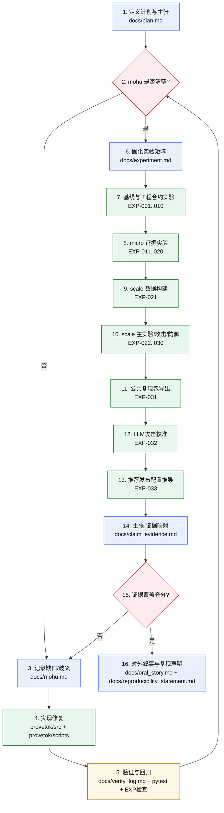
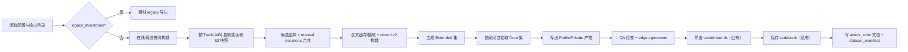

# SealedHistory / ProveTok

Reproducible dataset pipeline + benchmark harness for **SealedHistory** (sealed micro-history records, leakage audits, and evaluation).

## Docs (state machine)

This repo follows a doc-driven workflow. The four state files are:
- `docs/plan.md`: claims + evidence map + contracts (canonical)
- `docs/mohu.md`: blocking gaps/ambiguities (must be empty to proceed)
- `docs/experiment.md`: experiment matrix + run log (what we ran, what it proved)
- `README.md`: runnable entry points (this file)

Additional specs:
- `plan.md`: dataset collection/build proposal (human-readable spec)
- `docs/data_requirements.md`: Public/Private artifact contract
- `docs/collection_checklist.md`: executable checklist for dataset release

## 项目中文工作流程（流程图）

### 1) 全项目闭环流程



### 2) 数据构建子流程（`provetok dataset build`）



### 3) 每一步作用（简述）

- 1）定义要证明的主张、指标和验收条件。
- 2）检查 `mohu` 是否还有阻塞项。
- 3）把缺口与歧义显式记录，避免隐性问题。
- 4）针对缺口做最小、可审计的代码实现。
- 5）运行测试与验收命令，确认改动有效。
- 6）把实验命令、输入、产物路径标准化。
- 7）先跑基线与工程合约实验，保证基础可复现。
- 8）运行 micro 实验，验证机制与诊断结论。
- 9）构建 scale 数据，进入非 toy 证据阶段。
- 10）运行 scale 主表、攻击、防御、统计与 holdout。
- 11）导出不含私有 codebook 的公开复现包。
- 12）用 LLM 攻击校准启发式泄漏指标。
- 13）从 tradeoff 曲线自动推导推荐发布配置。
- 14）将 claim 与 artifact 做一一映射。
- 15）若覆盖不足则回到缺口环继续迭代。
- 16）覆盖充分后输出 oral/story 与复现声明。

## Quickstart

### 1) Install
```bash
python -m venv .venv
# Windows (PowerShell)
./.venv/Scripts/python -m pip install -r provetok/requirements.txt

# macOS/Linux
./.venv/bin/python -m pip install -r provetok/requirements.txt

# Optional: install console script `provetok`
python -m pip install -e provetok
```

### 2) Run tests
```bash
python -m pytest -q
```

### 3) Benchmark smoke (no LLM)
```bash
python provetok/scripts/run_benchmark.py \
  --sealed provetok/data/sealed/micro_history_a.sealed.jsonl \
  --raw provetok/data/raw/micro_history_a.jsonl \
  --agent random \
  --output runs/EXP-001/eval_report_a.json
```

### 4) Dataset build (S2 pipeline)
```bash
python -m provetok.cli dataset build \
  --config provetok/configs/dataset.yaml \
  --track both \
  --out runs/exports
```

Outputs land under `runs/exports/{dataset_version}/{public|private}/...` (see `docs/data_requirements.md`).

## Key entry points

- Benchmark CLI: `python -m provetok.cli run --agent {random|copylast|dependency|frontier|llm} --sealed ... --raw ... --output ...`
- Dataset build: `python -m provetok.cli dataset build --config provetok/configs/dataset.yaml [--offline] [--track A|B|both]`
- v2 leakage audit: `python provetok/scripts/run_audit_v2.py --sealed_jsonl ... --codebook_json ... --output ...`

## Oral evidence pack

```bash
python provetok/scripts/run_oral_main_table.py --output_dir runs/EXP-011 --seeds 11 22 33
python provetok/scripts/run_oral_ablations.py --output_dir runs/EXP-013 --seeds 11 22 33
python provetok/scripts/run_oral_cross_domain.py --input runs/EXP-011/per_run_metrics.json --output_dir runs/EXP-014
python provetok/scripts/compute_human_eval_kappa.py --ratings_csv docs/templates/human_eval_sheet.csv --output_dir runs/EXP-015
```

Narrative pack:
- `docs/oral_checklist.md`
- `docs/oral_story.md`

## Demo codebooks (synthetic)

This repo includes demo sealed datasets under `provetok/data/sealed/` for offline smoke tests.
The matching `*.sealed.codebook.json` files in that folder are **synthetic demo mappings** used only for examples/tests.

Real dataset exports produced by `provetok dataset build` write private codebooks under:
- `runs/exports/{dataset_version}/private/mapping_key/seed_{seed}.codebook.json`

Do not publish or commit real codebooks from exports.

## Repo rules (gates)

- Do not add `try/except/finally` blocks in executable code.
- Keep outputs under `runs/` (gitignored).
